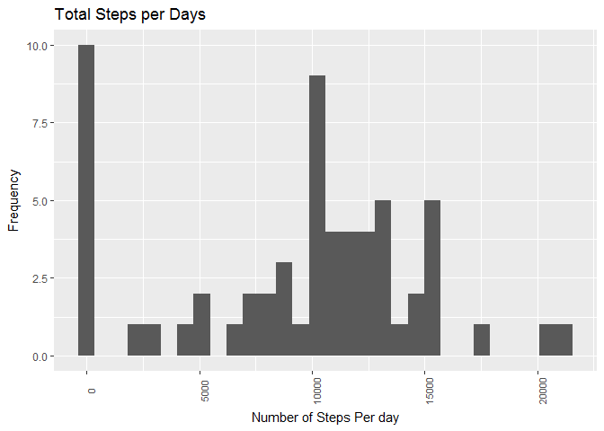
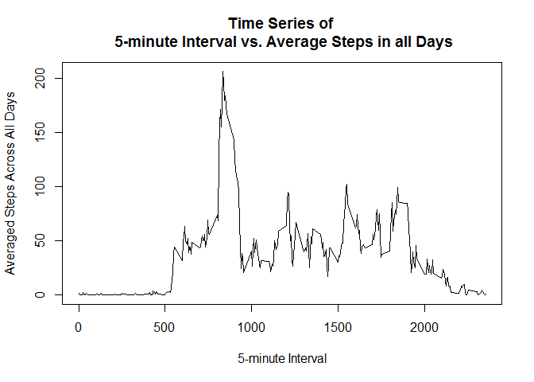
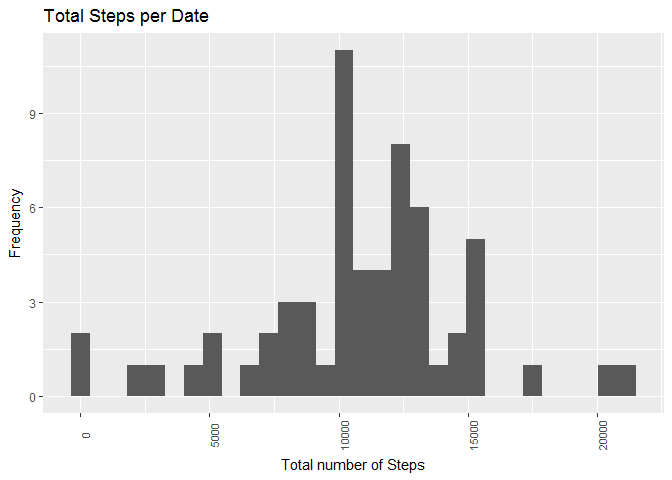
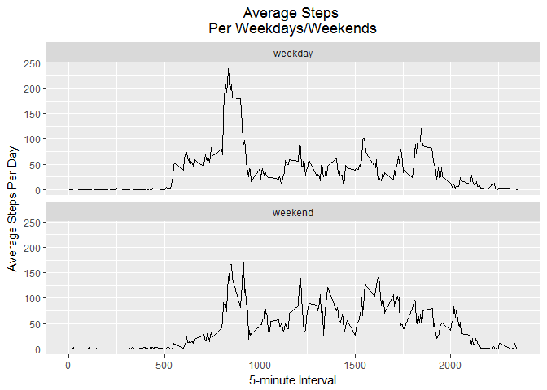

# Quantified Self-Movement Data Analysis 
JK  
May 12, 2017  


## Introduction

It is now possible to collect a large amount of data about personal movement using activity monitoring devices such as a Fitbit, Nike Fuelband, or Jawbone Up. These type of devices are part of the "quantified self" movement - a group of enthusiasts who take measurements about themselves regularly to improve their health, to find patterns in their behavior, or because they are tech geeks. But these data remain under-utilized both because the raw data are hard to obtain and there is a lack of statistical methods and software for processing and interpreting the data.

This report makes use of data from a personal activity monitoring device. This device collects data at 5 minute intervals through out the day. The data consists of two months of data from an anonymous individual collected during the months of October and November, 2012 and include the number of steps taken in 5 minute intervals each day.

## Loading and preprocessing the data

Initially, data needed for this study is located in directory beside this report and in zip formate. the following code unzip the data file and load it to frame work object, then print out first few lines:


```r
unzip("activity.zip")
dt<-read.csv("activity.csv",header = T)
head(dt)
```

```
##   steps       date interval
## 1    NA 2012-10-01        0
## 2    NA 2012-10-01        5
## 3    NA 2012-10-01       10
## 4    NA 2012-10-01       15
## 5    NA 2012-10-01       20
## 6    NA 2012-10-01       25
```

The following analysis goes into parts, and each part answer different questions about the present data.

## Steps Per Day
The part analyze the total number of steps per day for the given data, with any consideration for the missing data (i.e. NA's).

1- Calculation of Total Number of steps per day: we aggregate the data frame for sum of steps per date; and then print head of the aggregation data frame.


```r
dt$date<- as.Date(as.character(dt$date),"%Y-%m-%d")
steps_per_day<-aggregate(dt$steps,list(date=dt$date),sum,na.rm=TRUE)
head(steps_per_day)
```

```
##         date     x
## 1 2012-10-01     0
## 2 2012-10-02   126
## 3 2012-10-03 11352
## 4 2012-10-04 12116
## 5 2012-10-05 13294
## 6 2012-10-06 15420
```

2- Plot histogram for total steps per day: ggplot is used to plot out the total number of steps per day aggregated in step 1.


```r
library(ggplot2)
g<- ggplot(steps_per_day, aes(x=x))
g <- g + geom_histogram(bins = 30)
g<- g + labs(x="Number of Steps Per day",y="Frequency",title="Total Steps per Days")
g + theme(axis.text.x = element_text(size=8,angle = 90))
```

<!-- -->

3-  Calculate mean and median of the total number of steps taken per day: 


```r
print(paste("Total Steps per day mean =" , format(mean(steps_per_day$x), digits=2, nsmall=2)))
```

```
## [1] "Total Steps per day mean = 9354.23"
```

```r
print(paste("Total Steps per day median =" , format(median(steps_per_day$x), digits=2, nsmall=2)))
```

```
## [1] "Total Steps per day median = 10395"
```

## The average daily activity pattern
This part analyzes the average number of steps on 5-minutes interval across all days to build an understanding about activity behaviour in a days.

1- Time series plot (5-minute interval averaged across all days):  we aggregate the given data for sum of steps per 5-minutes interval; and plot the result to show time series illustration.


```r
avr_steps_per_interval<-aggregate(dt$steps,list(interval=dt$interval),mean,na.rm=TRUE)

with(avr_steps_per_interval, plot(interval,x,type="l",xlab = "5-minute Interval", ylab = "Averaged Steps Across All Days",main = "Time Series of \n 5-minute Interval vs. Average Steps in all Days"))
```

<!-- -->

2- The maximum number of average steps across days:


```r
x<- avr_steps_per_interval[avr_steps_per_interval$x==max(avr_steps_per_interval$x),]

print(paste("Maximum number of steps per at internal =" , as.character(x[1])))
```

```
## [1] "Maximum number of steps per at internal = 835"
```

```r
print(paste("with number of steps =" , format(x[2], digits=2, nsmall=2)))
```

```
## [1] "with number of steps = 206.17"
```

## Imputing missing values
This part analyzes the missing data in the given dataset, develop stategy to impute these missing data, and disucss the its impact on the overall resutls.

1- Report the total number of missing values in the dataset:


```r
print(paste("The number of rows containing missing data is " , as.character(sum(!complete.cases(dt)))))
```

```
## [1] "The number of rows containing missing data is  2304"
```

```r
print(paste("And, number of steps containing missing data is " , as.character(sum(sum(is.na(dt$steps))))))
```

```
## [1] "And, number of steps containing missing data is  2304"
```

2- Strategy for filling in all of the missing values in the dataset: The developed strategy to impute the missing data in Steps column is based in the notion that human activity usually repetitive per day of week and time interval. For example, usually people go at same time to work. We are here calculating the avaerage number of steps for 5-minutes interval for same week day. Then, the result is stored in a dataset to be used as replacement map of any missed value.


```r
udt<-dt[,c(1:3)]
udt$date<- as.Date(as.character(udt$date),"%Y-%m-%d")
udt$interval_weekday<-paste0(as.character(udt$interval),"-",as.character(weekdays(udt$date)))
steps_weeklymean_map<-aggregate(udt$steps,list(interval_weekday=udt$interval_weekday),mean,na.rm=T)
head(steps_weeklymean_map)
```

```
##   interval_weekday        x
## 1         0-Friday 0.000000
## 2         0-Monday 1.428571
## 3       0-Saturday 0.000000
## 4         0-Sunday 0.000000
## 5       0-Thursday 5.875000
## 6        0-Tuesday 0.000000
```

3- Create a new dataset with missing data replaced: using (x) dataset created in the pervious step, next; we are calculating missed data and replace it in this new dataset.


```r
udt$steps_wNA<-ifelse(!is.na(udt$steps),udt$steps,steps_weeklymean_map$x[match(udt[is.na(dt$steps),4],steps_weeklymean_map[,1])])
head(udt,3)
```

```
##   steps       date interval interval_weekday steps_wNA
## 1    NA 2012-10-01        0         0-Monday  1.428571
## 2    NA 2012-10-01        5         5-Monday  0.000000
## 3    NA 2012-10-01       10        10-Monday  0.000000
```

4- Analyze the new dataset:
  
  4-1 Plot histogram of the total number of steps taken each day: we first aggregate the new dataset by summung the updated number of steps by date, then plot the result into histogram.
  

```r
steps_per_day<-aggregate(udt$steps_wNA,list(date=udt$date),sum,na.rm=TRUE)

g<-ggplot(steps_per_day, aes(x=x))
g<- g + labs(x="Total number of Steps",y="Frequency",title="Total Steps per Date")
g + geom_histogram(bins = 30) + theme(axis.text.x = element_text(size=8,angle = 90))
```

<!-- -->

  4-2 Calculate mean and median of the new total number of steps taken per day: 


```r
print(paste("Total Steps per day mean =" , format(mean(steps_per_day$x), digits=2, nsmall=2)))
```

```
## [1] "Total Steps per day mean = 10829.00"
```

```r
print(paste("Total Steps per day median =" , format(median(steps_per_day$x), digits=2, nsmall=2)))
```

```
## [1] "Total Steps per day median = 11015.00"
```

  4-3 Compare the result of the updated dataset versus the original dataset to illustrate the impact of replacing the missing values on the overall results:
  
  Comparing the Histograms for both cases, we can notice that replacing NAs doesn't change most of the peaks which are days with highest number of steps. A new peak can be noticed at the left of the updated dataset. 
  
  Comparing the mean/median values for both cases, we cannot see significant difference with (+13.6%) in the mean value, and (+5%) in the mean value.
  
  This result shows that the deviced strategy helps to reduce the anomality of having missed values during the data analysis, though, it doesn't impact the overall behavior of the results.
  
## Activity patterns between weekdays and weekends
This part of the report analyze the activity patterns based on two groups: week days and weekends days.

1- Create a new factor variable in the dataset with two levels - "weekday" and "weekend", and add the new feature (column) to the update dataset that includes no NAs.


```r
udt$wday <- as.factor(ifelse(weekdays(udt$date) %in% c("Saturday","Sunday") ,"weekend","weekday"))
```

2- Create time series plot that shows the patern of the average number of steps per 5-minutes interval for both weekdays and weekends categories. First, we start by creating aggregated dataset that contains the result of calculating mean values for both categories. Then, the plot comes after.


```r
x1<-aggregate(udt$steps_wNA,list(interval=udt$interval,wday=udt$wday),mean)

g<- ggplot(data=x1,aes(x=x1$interval,y=x1$x)) + geom_line()
g<- g + facet_wrap( ~ x1$wday, ncol=1) 
g<- g + labs(x= "5-minute Interval",y="Average Steps Per Day",title="Average Steps \nPer Weekdays/Weekends")
g + theme(plot.title = element_text(hjust = 0.5))
```

<!-- -->
